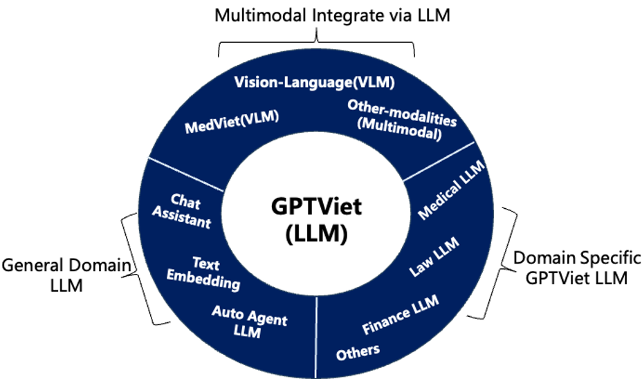
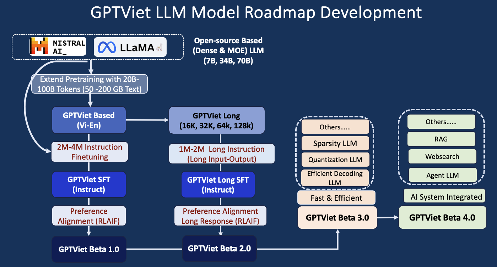

<h1 align="center">
   GPTViet - Advancing Foundation Models
</h1>

This project aims to develop a bilingual foundation model both language and multimodal capabilities. The objective is to enhance an existing Open-source English English model, optimizing it for the Vietnamese language.

<h3 align="center">
   GPTViet - Target Development
</h3>

     

## 💡 Get help - [Q&A](https://github.com/TranNhiem/Vietnamese_LLMs/discussions) or [Discord 💬](https://discord.gg/BC8Mqq8qYn)

## 1. Roadmap Development of GPTViet's Language Foundation Model: 

     

## Demo Language Model: 

     

+ [**GPTViet 8B Demo Chat & Websearch Integration**](http://140.115.53.106:8888/)
+ [**GPTViet 70B Demo Coming Soon**]()
+ [**GPTViet Document Chat Demo Coming Soon**]()

## Performance Benchmarks on Multiple Task: 
+ Access Benchmark Data
+ Access Benchmark Performance Setting
+ 

## Giúp Đỡ (How You can HELP)
1. Nhằm để hỗ trợ tài chính Nhóm xin nhận làm các dự án của công ty tư nhân, các tổ chức nghiên cứu, hoặc cá nhân.
2. Bạn có thể hổ trợ về tài nguyên như máy chủ server hoặc các tài nguyên khác.
  - Dự án hiện rất cần các nguồn tài trợ tài nguyên GPUs để có thể tiến hành quá trình huấn luyện (Training Model).
  - Bạn có thể kết nối trực tiếp với Trần Nhiệm [email]: tvnhiemhcmus@gmail.com. Hoặc có thể chat trực tiếp ở: [LinkedIn](https://www.linkedin.com/in/tran-nhiem-ab1851125/) [Facebook](https://www.facebook.com/jean.tran.336). [X](https://twitter.com/TranRick2). [Zalo -- +886 934 311 751]()
